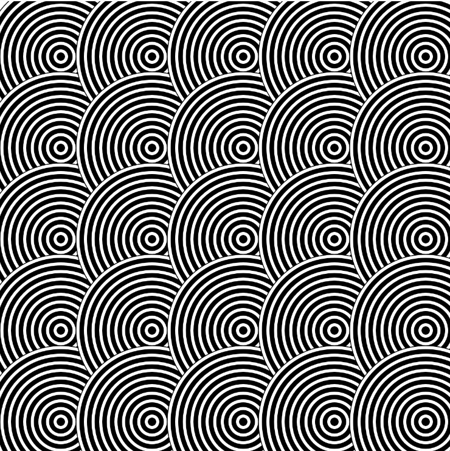
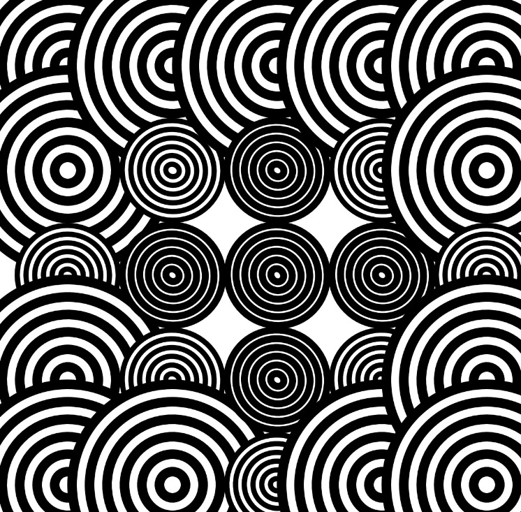
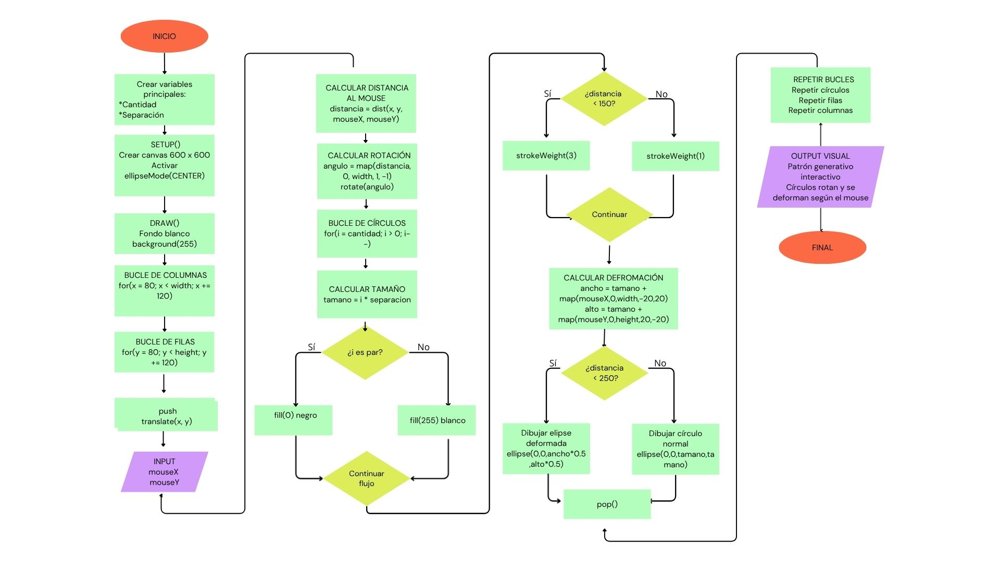

# Solemne-2--secc3
Sobre el proceso de mi solemne dos, tanto los errores como los códigos correctos.
## sobre este respositorio
- Nombre del proyecto
- Descripción
- Inspiración
- Proceso
- Resultado
- Diagrama de flujo

## Nombre del proyecto      
Op art interactivo   
**Autor:** Angela Sepulveda
El proyecto se basa en un sistema visual interactivo, inspirado en el movimiento artístico Op Art el cual busca demostrar que al poner distintos comandos se puede producir comportamientos visuales complejos y dinamicos.

## Descripción 
**Qué se ve en pantalla**      
En pantalla se observa un patrón de círculos distribuidos en filas y columnas que reaccionan dinámicamente al movimiento del mouse.    
**Qué elementos visuales aparecen**      
Aparecen elipces en blanco y negro, rotaciones dinámicas, variaciones de grosor en las líneas y deformaciones que cambian según la interacción del usuario.    
**Qué inputs utiliza**     
El sistema utiliza como input la posición del mouse en el eje horizontal y vertical (mouseX y mouseY), permitiendo modificar la deformación, rotación y comportamiento visual de las figuras.     
**Qué outputs genera**       
El output generado es una composición visual interactiva y dinámica donde los círculos cambian su forma, orientación y apariencia en tiempo real según el movimiento del usuario.

## Inspiración      
Como se menciono anteriormente, al estar buscando referentes de ideas me quede con el "Op Art" y opte por la idea de hacerlo blanco y negro porque se aprecia muy bien los cambios al estar interactuando con el programa, por esto mismo tome de referencia a 
**Bridget Riley:**(nacida en 1931),destacada pintora británica y una figura clave en el movimiento del Arte Óptico (obra con fecha de 1962)Usa figuras geométricas y colores para crear ilusiones de movimientoy cabe destacar que fue la primera mujer en ganar el premio de pintura de la Bienal de Venecia (1968).
       
y a la vez busque en varios sitios este tipo de obras:        
     

A partir de la exploración de patrones visuales, surgió la idea de mezclar dos tipos de composiciones inspiradas en ilusiones ópticas. La idea es Repetir circulos que generan vibración visual y sensación de expansión.
Por esto mismo se me ocurrió mezclar ambas ideas en la obra y como el sistema debe ser dinamico decidí que los círculos cambiaran según la interacción del mouse.

## PROCEDIMIENTO
- Primero elegi las variables de la cantidad de figuras para la cual luego de disntintas pruebas visuales me quede con 
let cantidad = 12;
let separacion = 20;
Con esto definí cuántos círculos aparecerían dentro de cada módulo y la distancia entre ellos. Probé distintas cantidades, pero con demasiadas figuras la composición comenzaba a verse saturada visualmente,

 por lo que 12 me permitió mantener un mejor equilibrio.

Después comencé el setup() creando el lienzo donde se iba a dibujar toda la composición. Elegí un canvas cuadrado de 600x600 porque permitía distribuir los módulos de forma más ordenada dentro del espacio. También usé ellipseMode(CENTER) para que las figuras se dibujaran desde el centro y así controlar mejor las deformaciones y rotaciones.

Luego, dentro de draw(), agregué un fondo blanco para limpiar el frame constantemente y evitar rastros del movimiento.

Después hice dos recorridos con for para organizar las figuras en filas y columnas, generando una retícula repetitiva parecida a un patrón modular. Utilicé separaciones de 120 píxeles porque cuando probé distancias más pequeñas los módulos comenzaban a superponerse y perdían legibilidad visual.

Dentro de cada módulo usé push() y pop() para que cada figura tuviera su propia transformación independiente. Luego, con translate(x,y), moví el punto de origen hacia cada posición de la grilla.

Después calculé la distancia entre el mouse y cada módulo:

let distancia = dist(x,y,mouseX,mouseY);

Posteriormente transformé esa distancia en un ángulo para generar rotación:

let angulo = map(distancia,0,width,1,-1);

rotate(angulo);

Mientras más cerca estaba el mouse, mayor era el cambio en la orientación de las figuras.

Luego hice otro for para dibujar múltiples círculos dentro de cada módulo. El tamaño de cada círculo dependía de la variable i, generando un efecto concéntrico:

let tamano = i * separacion;

Después llamé la función cambiarColor(i) para alternar blanco y negro:

function cambiarColor(i){

  if(i % 2 == 0){
 fill(0);
} else {
fill(255);
  }
}
Usé % para alternar colores y generar mayor contraste visual. Finalmente modifiqué el grosor de línea y la deformación de las figuras según la cercanía y movimiento del mouse, logrando una composición más dinámica e interactiva. El uso de pop() permitió que cada módulo mantuviera su propia posición y rotación sin afectar a los demás elementos. 
## Resultado 
Finalmente p5.js logra crear un patrón interactivo de círculos que se deforman y rotan dinámicamente según el movimiento del mouse (imagen de uno de los resultados posibles)

## Diagrama de flujo
El siguiente diagrama de flujo representa el funcionamiento del sistema generativo desarrollado en p5.js. En él se muestran las variables principales, los bucles, las condiciones y la interacción con el mouse que permiten generar patrones dinámicos y deformaciones en los círculos.

           
                
